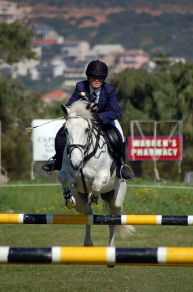
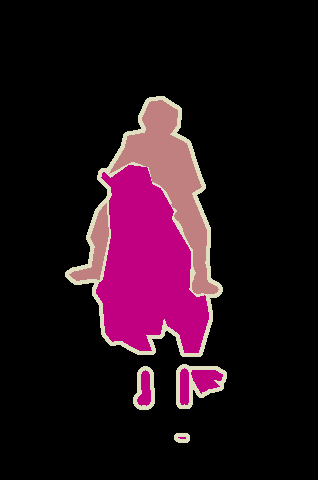
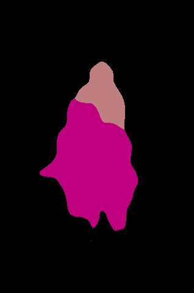

# pytorch-deeplab-xception

### Original Code from https://github.com/jfzhang95/pytorch-deeplab-xception

### The Following things are added and modified from original code

Specified for PASCAL VOC data.

For other open datasets, code will be updated.

## 2022-04-22
- [x] Add calculating MIOU code for valid data (calculate_miou.py)
- [x] Add visualize code (test_pascal.py)
- [x] Add selecting GPU


Environment
 - Using docker image from dockerhub
 - pytorch : 1.8.1
 - cuda : 11.1
 - cudnn : 8
 - GPU : Tesla K80 & GTX 1070 (selectively used 1 GPU)


### Data setting
Please set your data path into mypath.py

### Training
Please set your own hyper-parameters(arguments) inside train.py


```Shell
python train.py
```

### Testing(MIOU)

```Shell
python calculate_miou.py
```

### Visualizing(Single image)

```Shell
python test_pascal.py
```

### result
result using default parameters
| Backbone  | train/eval os  |mIoU in val |Pretrained Model|
| :-------- | :------------: |:---------: |:--------------:|
| ResNet    | 16/16          | 71.95%     | [google drive](https://drive.google.com/file/d/1I7ptPnM0KSBF37xm27bdUGPfcfKuZFbf/view?usp=sharing) |


### visualize image




Additional backbone or segmentation model will be uploaded later
